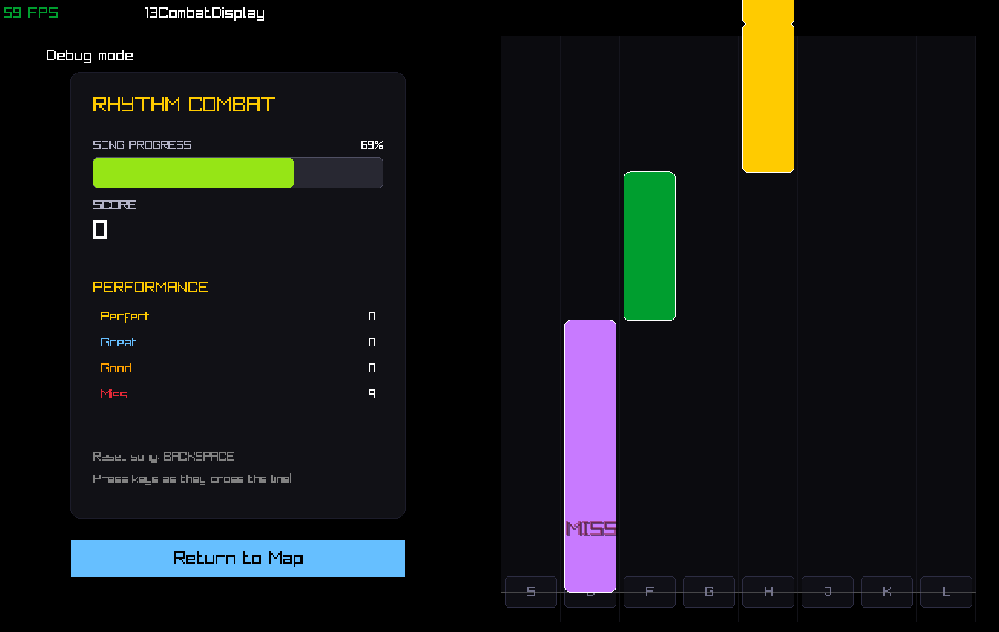

<!-- Centering logo and header using HTML -->
<div align="center">

  # One Hit Wonder 🎵
  **A rhythm game made for Major Game Jam.**

  <!-- [](LICENSE)
  [](https://github.com/USER/REPO/releases) -->
  [](https://github.com/USER/REPO)


</div>

---

## About the Game

An rhythm game where you play as a hero trapped in a dungeon. Can you escape the dungeon and become a One Hit Wonder?

You got trapped in a dungeon because you were too good at playing the flute. Now you have to fight your way out using your musical skills. Can you escape the dungeon and become a One Hit Wonder?


> You need to escape from dungeon by defeating the enemies on each floor. Fight using the music and your flute 
### Screenshots

<div align="center">
  <!-- HTML allows controlling the image width so they look nice next to each other -->
  
  
</div>

---

## Installation & Setup

### System Requirements
* **OS:** Linux / Windows 10/11
* **Dependencies:** G++ compiler (C++20 support), CMake (Only for Linux)
### Run (Windows)

- Download the release
- Open folder
- Run **OneHitWonder.exe**

### Compilation and execution (Linux)

Short and clear instructions in a code block:

```bash
# Clone the repository
git clone https://github.com/Saniccxx/One-Hit-Wonder.git
cd One-Hit-Wonder

mkdir build && cd build
cmake ..
make

./OneHitWonder
